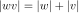

# Practice \# 1: Formal Languages and String

## Objective

Implementation of the basics operations for string manipulation, such as

-   Alphabet

-   Length

-   Concatenation

-   Pow

-   Inverse

-   Occurrences

-   Equality

## Problem description 

The student must implement the basic operations for string manipulation.

### Alphabet of a string 

The alphabet of a string  is the set of symbols used to form  ,
denoted by 
That is if  then 
for all .

### Length of a string 

The length of a string  is the number of symbols that occur in  ,
denoted by 
That is if  then .

### Concatenation of strings 

Given two strings   and , the concatenation of strings makes a new
string  by putting them together end to end.

- If  and , then 

- 

- 

### Pow of a string 

Let  y .  denote the string we
obtain by concatenating  copies of  : <div align="center"></div>

### Inverse of a string 

The **inverse** of a string  is the string  defined by the rule:

<div align="center"></div>

### Occurrences of a string 

Let  and , then  is the number of 's in  

### Equality of strings 

Given two strings  and , we
say that the strings are **equal** , if  and  for all 

## General guidelines 

### Implementation design:  

The student must create each of the operations described above as a function. The student should properly document any alternative solution.

The student must create each function using the following prototypes.

### Alphabet function prototype: 

The function must receive a string as an array of chars and return the
alphabet as an array of chars


```c
char* alphabet(char* w);
```


### Length function prototype: 

The function must receive a string as an array of chars and return the
length of a string as an integer number


```c
int len(char* w);
```


### Concatenation function prototype: 

The function must receive two strings as an array of chars and return
the concatenation as an array of chars


```c
char* concat(char* w,char* v);
```


### Pow function prototype: 

The function must receive a string as an array of chars and the pow as
an integer and return the pow of the string as an array of chars


```c
char* pow(char* w,int n);
```


### Inverse function prototype: 

The function must receive a string as an array of chars and return the
inverse as an array of chars


```c
char* inverse(char* w);
```


### Occurrences function prototype: 

The function must receive a symbol as a char and a string as an array of
chars and return the occurrences of the symbol in the string as an
integer number


```c
int occurrences(char a,char* w);
```


### Equality function prototype: 

The function must receive two strings as an array of chars and return if
the two strings are equal or not as an integer. 0 if the strings are
different and 1 if the strings are equal.


```c
int equal(char* w,char* v);
```


## Implementation Language: 

The programming language to use is either C or C++.

- The use of libraries for string manipulation such as ***string.h***, ***cstring*** or others, is restricted.

- The use of the string data type is restricted

- Each function must be developed from scratch, using only control
    statements and data structures.

    -   The student could use data structures from C++ such as set,
        vector, map, list, stack, queue etc.

-   The student must use memory management correctly:

    -   To create a memory slot in C use `malloc`
        ```c
        char* result = (char*)malloc(10*sizeof(char));
        ```

    -   To delete a memory space in C use `free`
        ```c
        free(result);
        ```

    -   To create a memory slot in C++ use `new`
        ```c
        char* result = new char[10];
        ```

    -   To delete a memory slot in C++ use `delete`
        ```c
        delete[] result;
        ```

## Evaluation requirements 

1.  **Verification**: The functions will be tested automatically in Github using unit tests. It will be expected to pass all the test cases; otherwise, the grade will be lower.

2.  **Report**: The student must elaborate a report with the format seen
    in the first class. The student should report

    1.  The decisions made for each section (techniques, data types, data structures, findings, and so on)

    2.  The problems that the student faced with the practice and the proposed solutions.

## Examples 

1.  Alphabet of a string
    ```c
    printf("%s",alphabet("686f6c61")); //"68fc1"
    ```

2.  Length of a string
    ```c
    printf("%d",len("686f6c61")); //8
    ```

3.  Concatenation of strings
    ```c
    printf("%s",concat("686f6c61","206d756e646f")); //"686f6c61206d756e646f"
    ```

4.  Pow of a string
    ```c
    printf("%s",pow("6d756e646f",3)); //"6d756e646f6d756e646f6d756e646f"
    ```

5.  Inverse of a string
    ```c
    printf("%s",inverse("evausabarimel")); //"lemirabasuave"
    ```

6.  Occurrences of a string
    ```c
    printf("%d",ocurrences('6',"686f6c61")); //4
    ```

7.  Equality of strings
    ```c
    printf("%d",equal("Hola","hola")); //0
    ```
